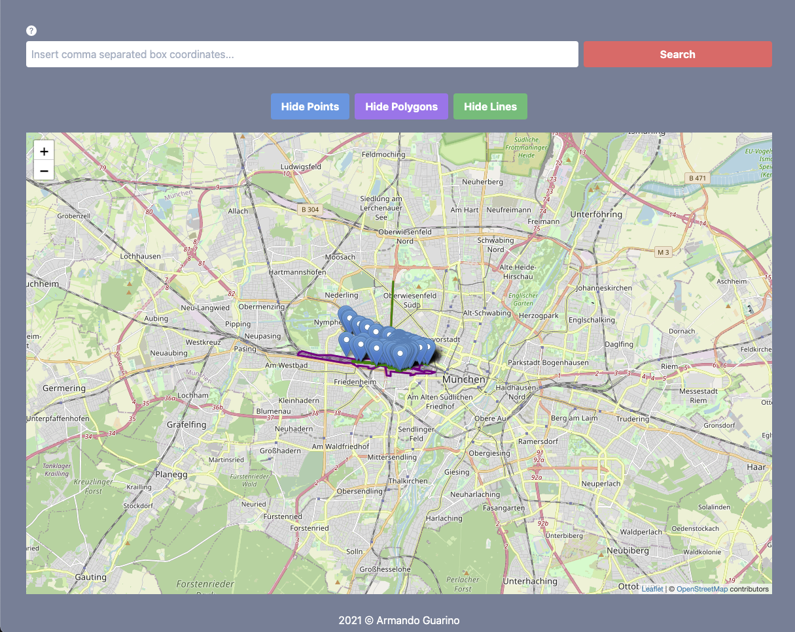

# coding-challenge :rocket:




## Overview

This coding challenge consists of a single page web application that:
- Fetches osm data of a location from [Openstreetmap api](https://www.openstreetmap.org/api/0.6/map), given with the coordinates as (geolocation box)
- Has an integrated custom [express](https://expressjs.com/) server from which calls to the external API are performed
- Converts the data into GeoJSON using [Osmtogeojson](https://github.com/tyrasd/osmtogeojson)
- Flips latitude and longitude using [Geojson-flip](https://www.npmjs.com/package/geojson-flip)
- Displays the dataset on a map using [Leaflet](https://leafletjs.com/) and [React-leaflet](https://react-leaflet.js.org/)
- Shares state across components using [Redux](https://redux.js.org/)
- Uses [Tailwindcss](https://tailwindcss.com/) as a CSS framework
- Is designed having in mind modularity & scalability; Follows the latest coding standards guidelines
- Correctly performs data & error validation
- Tests the correct rendering of the form components using [testing-library-react](https://testing-library.com/docs/react-testing-library/intro/)
- Hosts both front and back-end on [Heroku](https://coding--challenge.herokuapp.com/)
- Has used [Gitflow](https://www.atlassian.com/git/tutorials/comparing-workflows/gitflow-workflow) as a Git workflow

[Checkout the demo](https://coding--challenge.herokuapp.com/)

## Technologies used

- React v17.0.1
- Redux v4.0.5
- React-redux v7.2.2
- Redux-thunk v2.3.0
- Redux-devtools-extension v2.13.8
- Tailwindcss v1.9.6
- React-icons v4.2.0
- Uuid: v8.3.2
- Express v4.17.1
- Axios v0.21.1
- Leaflet v1.7.1
- React-leaflet v3.1.0
- Geojson-flip v1.0.0
- Osmtogeojson v3.0.0-beta.4
- Concurrently v6.0.2
- Nodemon v2.0.7

## Setup :hammer_and_wrench:

To run the app locally, clone the repo and install the app using:

```
  $ git clone https://github.com/guarmo/coding-challenge.git
  $ cd coding-challenge
  $ cd client
  $ npm install
  $ cd ..
  $ npm install
  $ npm run dev
```

## Unity testing :hammer_and_wrench:

To run the tests, after the installation run:

```
  $ cd client
  $ npm run test
```

## Contributors :sparkler:

This project is designed and developed by [Armando Guarino](https://armandoguarino.dev)

## Contributing

Thanks for your interest in contributing! There are many ways to contribute to this project. Get [started here](CONTRIBUTING.md).

Wishlist:

- Improve GUI
- Implement backend validation on routes
- Add further Unity Testing

## License

This project is open source and available under the [MIT License](LICENSE.md).
